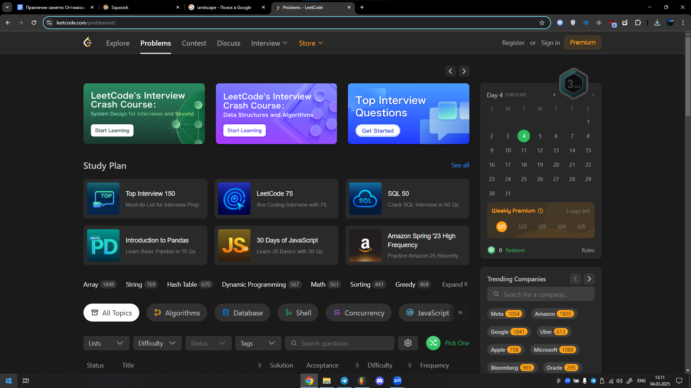
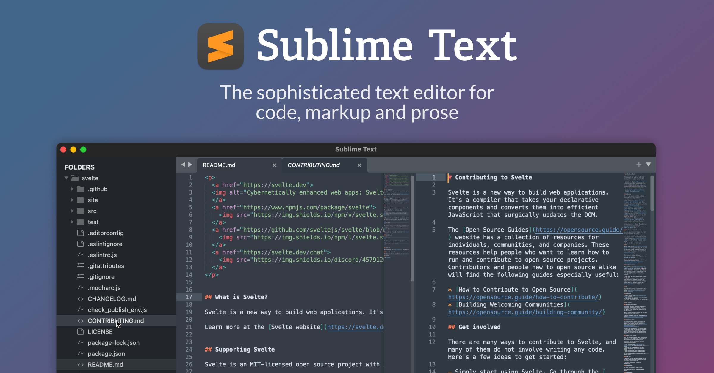

# Workshop N: Оптимізація зображень

## Початкові зображення
| Файл | Формат | Розмір (px) | Вага (MB) |
|---|---|---|---|
| landscape.jpg | JPEG | 6000 x 4000 | 2.08 |
| screenshot.png | PNG | 1920 x 1080 | 479 KB |
| image with text.jpg | JPEG | 2400 x 1256 | 1.36 |

## Порівняння розмірів файлів після різних типів стиснення

| Формат | landscape | screenshot | image with text |
|---|---|---|---|
| **PNG** | 27.5 MB | 479 KB | 2.41 MB |
| **WEBP (lossless)** | 14.7 MB | 340 KB | 1.44 MB |
| **MozJPEG (100%)** | 6.15 MB | 710 KB | 1.35 MB |
| **WEBP (lossy, 100%)** | 6.31 MB | 233 KB | 387 KB |
| **AVIF (100%)** | 3.73 MB | 201 KB | 489 KB |
| **MozJPEG (75%)** | 1.95 MB | 128 KB | 181 KB |
| **WEBP (lossy, 75%)** | 1.21 MB | 85.8 KB | 134 KB |
| **AVIF (75%)** | 1.89 MB | 71.0 KB | 133 KB |
| **MozJPEG (50%)** | 616 KB | 87.5 KB | 127 KB |
| **WEBP (lossy, 50%)** | 637 KB | 69.7 KB | 108 KB |
| **AVIF (50%)** | 409 KB | 48.4 KB | 93.9 KB |

## Оптимізація розмірів для різних пристроїв

| Пристрій | landscape | screenshot | image with text |
|---|---|---|---|
| **Оригінал** | 6000 x 4000, 2.08 MB | 1920 x 1080, 479 KB | 2400 x 1256, 1.36 MB |
| **WEB** | 56 KB | 468 KB | 510 KB |
| **MOBILE** | 17.6 KB | 162 KB | 156 KB |
| **RETINA (2x)** | 5.56 MB | 3.04 MB | 1.52 MB |

## Відображення зображень

### Оригінали

## Висновки
- **Формати:**
  - PNG підходить для зображень без втрати якості, але займає багато місця.
  - WEBP і AVIF забезпечують хороше стиснення з якісним відображенням.
  - MozJPEG ефективний для зменшення ваги без значної втрати якості.
- **Зміна розміру:**
  - Оптимізація розміру значно зменшує вагу файлу, що покращує завантаження на веб-сторінках.
- **Адаптація для Retina:**
  - Для дисплеїв Retina варто використовувати 2x версії, але компромісом може бути WEBP або AVIF для збереження якості при меншому розмірі файлу.
